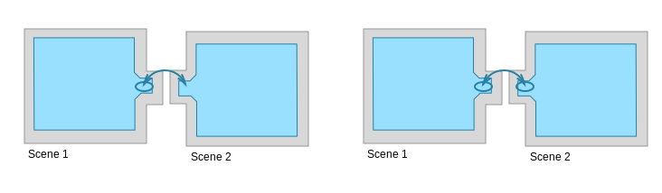

# Loading Multiple NavMeshes using Additive Loading

The NavMeshes in different [**Scenes**][1] are not connect by default. When you load another level using _Application.LoadLevelAdditive()_ you will need to connect the NavMeshes in different Scenes using an Off-Mesh link.

In this example we have _Scene 1_ and _Scene 2_. The _Scene 1_ has an Off-Mesh Link starting over a walkable area and landing over a walkable area in _Scene 2_. There can be as many Off-Mesh Links connecting the Scenes as necessary.

When authored the other end point of the scene connecting Off-Mesh links are not connected. After a new Scene is loaded, the Off-Mesh Links will be reconnected.

If the multiple scenes have [**NavMesh**][2] overlapping at the same area, the position picking may be arbitrary NavMesh at that location. This applies to agents, Off-Mesh Links and position picking using the NavMesh API. You should create the scene crossing Off-Mesh links so that they start and end clearly on over one NavMesh only. Overlapping NavMesh areas are not automatically connected.

### Additional resources

- [Building a NavMesh](./BuildingNavMesh.md) – workflow for NavMesh baking.
- [Creating Off-Mesh Links](./CreateOffMeshLink.md) - learn how to manually create Off-Mesh Links.

[1]: https://docs.unity3d.com/Manual/CreatingScenes.html "A Scene contains the environments and menus of your game. Think of each unique Scene file as a unique level. In each Scene, you place your environments, obstacles, and decorations, essentially designing and building your game in pieces."
[2]: ./BuildingNavMesh.md "A mesh that Unity generates to approximate the walkable areas and obstacles in your environment for path finding and AI-controlled navigation."
