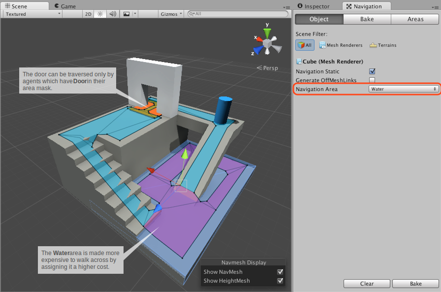
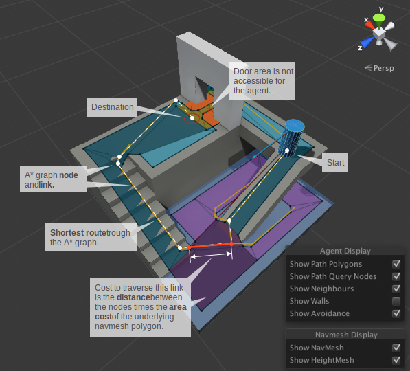
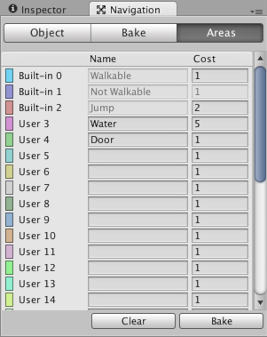
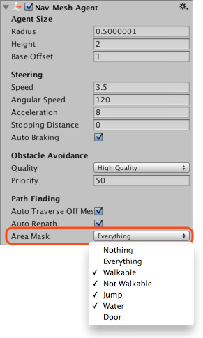

# Navigation Areas and Costs

The _Navigation Areas_ define how difficult it is to walk across a specific area, the lower cost areas will be preferred during path finding. In addition each [**NavMesh**][1] Agent has an _Area Mask_ which can be used to specify on which areas the agent can move.

In the above example the area types are used for two common use cases:

- **Water** area is made more costly to walk by assigning it a higher cost, to deal with a scenario where walking on shallow water is slower.
- **Door** area is made accessible by specific characters, to create a scenario where humans can walk through doors, but zombies cannot.

The area type can be assigned to every object that is included in the NavMesh baking, in addition, each Off-Mesh Link has a property to specify the area type.

## Pathfinding Cost

In a nutshell, the cost allows you to control which areas the pathfinder favors when finding a path. For example, if you set the cost of an area to 3.0, traveling across that area is considered to be three times longer than alternative routes.

To fully understand how the cost works, let’s take a look at how the pathfinder works.

Nodes and links visited during pathfinding.

Unity uses A\* to calculate the shortest path on the NavMesh. A\* works on a graph of connected nodes. The algorithm starts from the nearest node to the path start and visits the connect nodes until the destination is reached.

Since the Unity navigation representation is a [**mesh**][2] of polygons, the first thing the pathfinder needs to do is to place a point on each polygon, which is the location of the node. The shortest path is then calculated between these nodes.

The yellow dots and lines in the above picture shows how the nodes and links are placed on the NavMesh, and in which order they are traversed during the A\*.

The cost to move between two nodes depends on the distance to travel and the cost associated with the area type of the polygon under the link, that is, _distance \* cost_. In practice this means, that if the cost of an area is 2.0, the distance across such polygon will appear to be twice as long. The A\* algorithm requires that all costs must be larger than 1.0.

The effect of the costs on the resulting path can be hard to tune, especially for longer paths. The best way to approach costs is to treat them as hints. For example, if you want the agents to not to use Off-Mesh Links too often, you could increase their cost. But it can be challenging to tune a behavior where the agents to prefer to walk on sidewalks.

Another thing you may notice on some levels is that the pathfinder does not always choose the very shortest path. The reason for this is the node placement. The effect can be noticeable in scenarios where big open areas are next to tiny obstacles, which results navigation mesh with very big and small polygons. In such cases the nodes on the big polygons may get placed anywhere in the big polygon and from the pathfinder’s point of view it looks like a detour.

The _cost_ per _area type_ can be set globally in the _Areas_ tab, or you can override them per agent using a script.

## Area Types

The area types are specified in the _Navigation Window_’s _Areas_ tab. There are 29 custom types, and 3 built-in types: _Walkable_, _Not Walkable_, and _Jump_.

- **Walkable** is a generic area type which specifies that the area can be walked on.
- **Not Walkable** is a generic area type which prevents navigation. It is useful for cases where you want to mark certain object to be an obstacle, but without getting NavMesh on top of it.
- **Jump** is an area type that is assigned to all auto-generated Off-Mesh Links.

If several objects of different area types are overlapping, the resulting navmesh area type will generally be the one with the highest index. There is one exception however: _Not Walkable_ always takes precedence. Which can be helpful if you need to block out an area.

## Area Mask

Each agent has an _Area Mask_ which describes which areas it can use when navigating. The area mask can be set in the agent properties, or the bitmask can be manipulated using a script at runtime.

The area mask is useful when you want only certain types characters to be able to walk through an area. For example, in a zombie evasion game, you could mark the area under each door with a _Door_ area type, and uncheck the Door area from the zombie character’s Area Mask.

### Additional resources

- [Building a NavMesh](./BuildingNavMesh.md) – workflow for NavMesh baking.
- [NavMeshAgent.areaMask](https://docs.unity3d.com/ScriptReference/AI.NavMeshAgent-areaMask.html) - Script API to set areaMask for an agent.
- [NavMeshAgent.SetAreaCost()](https://docs.unity3d.com/ScriptReference/AI.NavMeshAgent.SetAreaCost.html) - Script API to set area cost for an agent.

[1]: ./BuildingNavMesh.md "A mesh that Unity generates to approximate the walkable areas and obstacles in your environment for path finding and AI-controlled navigation."
[2]: https://docs.unity3d.com/Manual/comp-MeshGroup.html "The main graphics primitive of Unity. Meshes make up a large part of your 3D worlds. Unity supports triangulated or Quadrangulated polygon meshes. Nurbs, Nurms, Subdiv surfaces must be converted to polygons."
