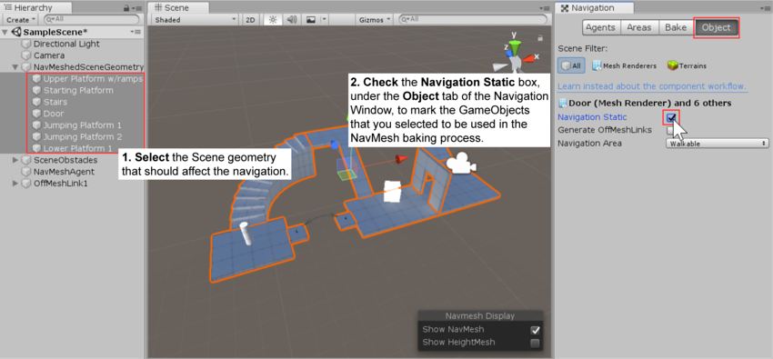
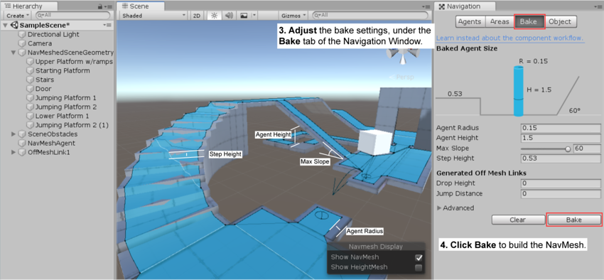
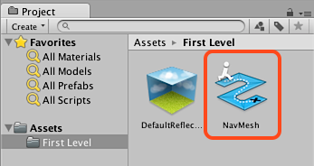
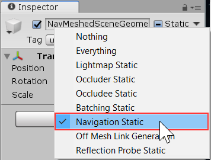

# Building a NavMesh

The process of creating a **NavMesh** from the level geometry is called NavMesh Baking. The process collects the Render Meshes and [**Terrains**][1] of all Game Objects which are marked as [Navigation Static](https://docs.unity3d.com/Manual/StaticObjects.html), and then processes them to create a navigation [**mesh**][2] that approximates the walkable surfaces of the level.

In Unity, NavMesh generation is handled from the Navigation window (menu: **Window** > **AI** > **Navigation**).

Building a NavMesh for your [**Scene**][3] can be done in 4 quick steps:

1. **Select** scene geometry that should affect the navigation – walkable surfaces and obstacles.
2. **Check Navigation Static** on to include selected objects in the NavMesh baking process.
3. **Adjust** the bake settings to match your agent size.
    - _Agent Radius_ defines how close the agent center can get to a wall or a ledge.
    - _Agent Height_ defines how low the spaces are that the agent can reach.
    - _Max Slope_ defines how steep the ramps are that the agent walk up.
    - _Step Height_ defines how high obstructions are that the agent can step on.
4. **Click bake** to build the NavMesh.

The resulting NavMesh will be shown in the scene as a blue overlay on the underlying level geometry whenever the Navigation Window is open and visible.

As you may have noticed in the above pictures, the walkable area in the generated NavMesh appears shrunk. The NavMesh represents the area where the center of the agent can move. Conceptually, it doesn’t matter whether you regard the agent as a point on a shrunken NavMesh or a circle on a full-size NavMesh since the two are equivalent. However, the point interpretation allows for better runtime efficiency and also allows the designer to see immediately whether an agent can squeeze through gaps without worrying about its radius.

Another thing to keep in mind is that the NavMesh is an approximation of the walkable surface. This can be seen for example in the stairs which are represented as a flat surface, while the source surface has steps. This is done in order to keep the NavMesh data size small. The side effect of the approximation is that sometimes you will need to have a little extra space in your level geometry to allow the agent to pass through any tight spots.

When baking is complete, you will find a NavMesh asset file inside a folder with the same name as the scene the NavMesh belongs to. For example, if you have a scene called _First Level_ in the Assets folder, the NavMesh will be at _Assets > First Level > NavMesh.asset_.

### Additional Workflows for Marking Objects for Baking

In addition to marking objects as _Navigation Static_ in the Navigation Window‚ as explained above, you can use the _Static_ menu at the top of the [**inspector**][4]. This can be convenient if you don’t happen to have the Navigation Window open.

### Additional resources

- [Creating a NavMeshAgent](./CreateNavMeshAgent.md) – learn how to allow your characters to move.
- [Bake Settings](./NavAdvancedSettings.md) – full description of the NavMesh bake settings.
- [Areas and Costs](./AreasAndCosts.md) – learn how to use different Area types.

[1]: https://docs.unity3d.com/Manual/terrain-UsingTerrains.html "The landscape in your scene. A Terrain GameObject adds a large flat plane to your scene and you can use the Terrain’s Inspector window to create a detailed landscape."
[2]: https://docs.unity3d.com/Manual/comp-MeshGroup.html "The main graphics primitive of Unity. Meshes make up a large part of your 3D worlds. Unity supports triangulated or Quadrangulated polygon meshes. Nurbs, Nurms, Subdiv surfaces must be converted to polygons."
[3]: https://docs.unity3d.com/Manual/CreatingScenes.html "A Scene contains the environments and menus of your game. Think of each unique Scene file as a unique level. In each Scene, you place your environments, obstacles, and decorations, essentially designing and building your game in pieces."
[4]: https://docs.unity3d.com/Manual/UsingTheInspector.html "A Unity window that displays information about the currently selected GameObject, asset or project settings, allowing you to inspect and edit the values."