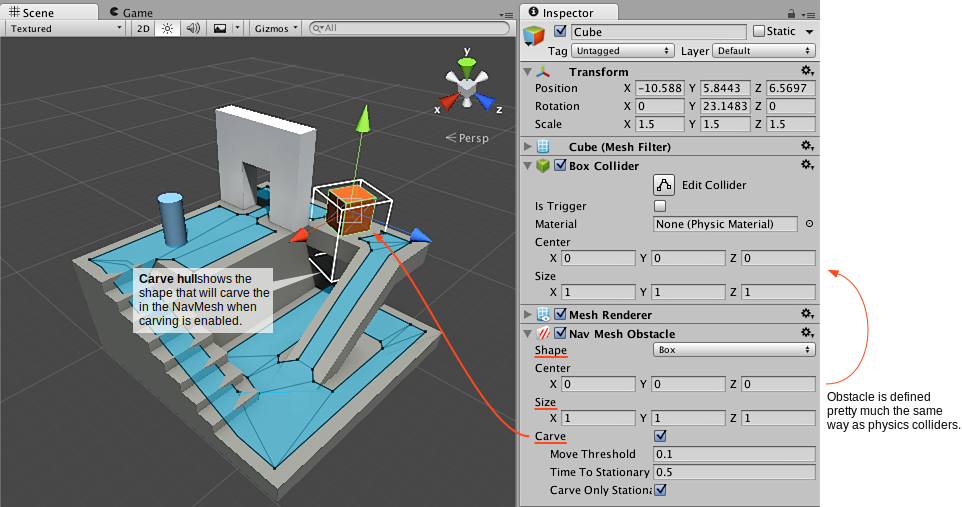

# Creating a NavMesh Obstacle

NavMesh Obstacle components can be used to describe obstacles the agents should avoid while navigating. For example the agents should avoid physics controlled objects, such as crates and barrels while moving.

We’re going to add a crate to block the pathway at the top of the level.

1. First create a **cube** to depict the crate: **Game Object > 3D Object > Cube**.
2. Move the cube to the platform at the top, the default size of the cube is good for a crate so leave it as it is.
3. Add a **NavMesh Obstacle component** to the cube. Choose **Add Component** from the inspector and choose **Navigation > NavMesh Obstacle**.
4. Set the shape of the obstacle to **box**, changing the shape will automatically fit the center and size to the render [**mesh**][1].
5. Add a **Rigid body** to the obstacle. Choose **Add Component** from the inspector and choose **Physics > Rigid Body**.
6. Finally turn on the **Carve** setting from the [**NavMesh**][2] Obstacle [**inspector**][3] so that the agent knows to find a path around the obstacle.

Now we have a working crate that is physics controlled, and which the AI knows how to avoid while navigating.

### Additional resources

- [Inner Workings of the Navigation System](./NavInnerWorkings.md) - learn more about how obstacles are used as part of navigation.
- [NavMesh Obstacle component reference](https://docs.unity3d.com/Manual/class-NavMeshObstacle.html) – full description of all the NavMesh Obstacle properties.
- [NavMesh Obstacle scripting reference](https://docs.unity3d.com/ScriptReference/AI.NavMeshObstacle.html) - full description of the NavMesh Obstacle scripting API.

[1]: https://docs.unity3d.com/Manual/comp-MeshGroup.html "The main graphics primitive of Unity. Meshes make up a large part of your 3D worlds. Unity supports triangulated or Quadrangulated polygon meshes. Nurbs, Nurms, Subdiv surfaces must be converted to polygons."
[2]: ./BuildingNavMesh.md "A mesh that Unity generates to approximate the walkable areas and obstacles in your environment for path finding and AI-controlled navigation."
[3]: https://docs.unity3d.com/Manual/UsingTheInspector.html "A Unity window that displays information about the currently selected GameObject, asset or project settings, allowing you to inspect and edit the values."