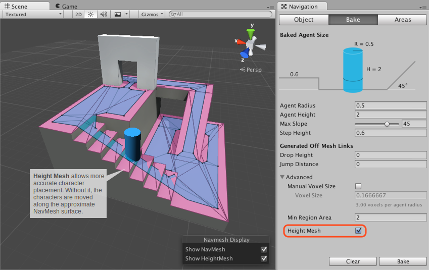

# Building Height Mesh for Accurate Character Placement

Height [**mesh**][1] allows you to place your character more accurately on the walkable surfaces.

While navigating, the [**NavMesh**][2] Agent is constrained on the surface of the NavMesh. Since the NavMesh is an approximation of the walkable space, some features are evened out when the NavMesh is being built. For example, stairs may appear as a slope in the NavMesh. If your game requires accurate placement of the agent, you should enable _Height Mesh_ building when you bake the NavMesh. The setting can be found under the Advanced settings in Navigation window. Note that building Height Mesh will take up memory and processing at runtime, and it will take a little longer to bake the NavMesh.

### Additional resources

- [Building a NavMesh](./BuildingNavMesh.md) – workflow for NavMesh baking.

[1]: https://docs.unity3d.com/Manual/comp-MeshGroup.html "The main graphics primitive of Unity. Meshes make up a large part of your 3D worlds. Unity supports triangulated or Quadrangulated polygon meshes. Nurbs, Nurms, Subdiv surfaces must be converted to polygons."
[2]: ./BuildingNavMesh.md "A mesh that Unity generates to approximate the walkable areas and obstacles in your environment for path finding and AI-controlled navigation."
