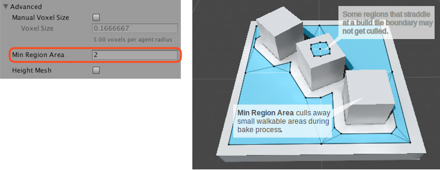
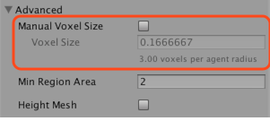

# Advanced NavMesh Bake Settings

## Min Region Area

The _Min Region Area_ advanced build settings allows you to cull away small non-connected [**NavMesh**][1] regions. NavMesh regions whose surface area is smaller than the specified value, will be removed.

Please note that some areas may not get removed despite the _Min Region Area_ setting. The NavMesh is built in parallel as a grid of tiles. If an area straddles a tile boundary, the area is not removed. The reason for this is that the area pruning happens at a stage in the build process where surrounding tiles are not accessible.

## Voxel Size

Manual **voxel** size allows you to change the accuracy at which the bake process operates.

The NavMesh bake process uses voxelization to build the NavMesh from arbitrary level geometry. In the first pass of the algorithm, the [**Scene**][2] is rasterized into voxels, then the walkable surfaces are extracted, and finally the walkable surfaces are turned into a navigation [**mesh**][3]. The voxel size describes how accurately the resulting NavMesh represents the scene geometry.

The default accuracy is set so that there are 3 voxels per agent radius, that is, the whole agent width is 6 voxels. This is a good trade off between accuracy and bake speed. Halving the voxel size will increase the memory usage by 4x and it will take 4x longer to build the scene.

Generally you should not need to adjust the voxel size, there are two scenarios where this might be necessary: building a _smaller agent radius_, or _more accurate_ NavMesh.

### Smaller Agent Radius

When you bake for an artificially smaller agent radius, the NavMesh bake system will also reduce the voxel size. If your other agent dimensions stays the same, it may not be necessary to increase the NavMesh build resolution.

The easiest way to do that is as follows:

1. Set the _Agent Radius_ to the real agent radius.
2. Turn on the _Manual Voxel Size_, this will take the current voxel size and “freeze it”.
3. Set the artificially smaller _Agent Radius_, since you have checked on the _Manual Voxel Size_ the voxel size will not change.

### More Accurate NavMesh

If your level has a lot of tight spots, you may want to increase the accuracy by making the voxel smaller. The label under the Voxel Size shows the relation between the voxel size and Agent Radius. A good range is something between 2–8, going further than that generally results really long build times.

When you intentionally build tight corridors in your game, please note that you should leave at least _4 \* voxelSize_ clearance in addition to the agent radius, especially if the corridors are at angles.

If you need smaller corridors than the NavMesh baking can support, please consider using Off-Mesh Links. These have the additional benefit that you can detect when they are being used and can, for example, play a specific animation.

### Additional resources

- [Building a NavMesh](./BuildingNavMesh.md) – workflow for NavMesh baking.
- [Building Off-Mesh Links Automatically](./BuildingOffMeshLinksAutomatically.md) - further details on automatic Off-Mesh Link generation.
- [Building Height Mesh for Accurate Character Placement](./HeightMesh.md) – workflow for Height Mesh baking.

[1]: ./BuildingNavMesh.md "A mesh that Unity generates to approximate the walkable areas and obstacles in your environment for path finding and AI-controlled navigation."
[2]: https://docs.unity3d.com/Manual/CreatingScenes.html "A Scene contains the environments and menus of your game. Think of each unique Scene file as a unique level. In each Scene, you place your environments, obstacles, and decorations, essentially designing and building your game in pieces."
[3]: https://docs.unity3d.com/Manual/comp-MeshGroup.html "The main graphics primitive of Unity. Meshes make up a large part of your 3D worlds. Unity supports triangulated or Quadrangulated polygon meshes. Nurbs, Nurms, Subdiv surfaces must be converted to polygons."