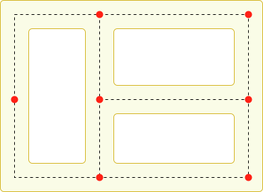

# Making an Agent Patrol Between a Set of Points

Many games feature NPCs that patrol automatically around the playing area. The navigation system can be used to implement this behaviour but it is slightly more involved than standard pathfinding - merely using the shortest path between two points makes for a limited and predictable patrol route. You can get a more convincing patrol pattern by keeping a set of key points that are “useful” for the NPC to pass through and visiting them in some kind of sequence. For example, in a maze, you might place the key patrol points at junctions and corners to ensure the agent checks every corridor. For an office building, the key points might be the individual offices and other rooms.



A maze with key patrol points marked

The ideal sequence of patrol points will depend on the way you want the NPCs to behave. For example, a robot would probably just visit the points in a methodical order while a human guard might try to catch the player out by using a more random pattern. The simple behaviour of the robot can be implemented using the code shown below.

The patrol points are supplied to the script using a public array of Transforms. This array can be assigned from the [**inspector**][1] using [**GameObjects**][2] to mark the points’ positions. The _GotoNextPoint_ function sets the destination point for the agent (which also starts it moving) and then selects the new destination that will be used on the next call. As it stands, the code cycles through the points in the sequence they occur in the array but you can easily modify this, say by using [Random.Range](https://docs.unity3d.com/ScriptReference/Random.Range.html) to choose an array index at random.

In the _Update_ function, the script checks how close the agent is to the destination using the [remainingDistance](https://docs.unity3d.com/ScriptReference/AI.NavMeshAgent-remainingDistance.html) property. When this distance is very small, a call to _GotoNextPoint_ is made to start the next leg of the patrol.

```
    // Patrol.cs
    using UnityEngine;
    using UnityEngine.AI;
    using System.Collections;


    public class Patrol : MonoBehaviour {

        public Transform[] points;
        private int destPoint = 0;
        private NavMeshAgent agent;


        void Start () {
            agent = GetComponent<NavMeshAgent>();

            // Disabling auto-braking allows for continuous movement
            // between points (ie, the agent doesn't slow down as it
            // approaches a destination point).
            agent.autoBraking = false;

            GotoNextPoint();
        }


        void GotoNextPoint() {
            // Returns if no points have been set up
            if (points.Length == 0)
                return;

            // Set the agent to go to the currently selected destination.
            agent.destination = points[destPoint].position;

            // Choose the next point in the array as the destination,
            // cycling to the start if necessary.
            destPoint = (destPoint + 1) % points.Length;
        }


        void Update () {
            // Choose the next destination point when the agent gets
            // close to the current one.
            if (!agent.pathPending && agent.remainingDistance < 0.5f)
                GotoNextPoint();
        }
    }
```

[1]: https://docs.unity3d.com/Manual/UsingTheInspector.html "A Unity window that displays information about the currently selected GameObject, asset or project settings, allowing you to inspect and edit the values."
[2]: https://docs.unity3d.com/Manual/class-GameObject.html "The fundamental object in Unity scenes, which can represent characters, props, scenery, cameras, waypoints, and more. A GameObject’s functionality is defined by the Components attached to it."