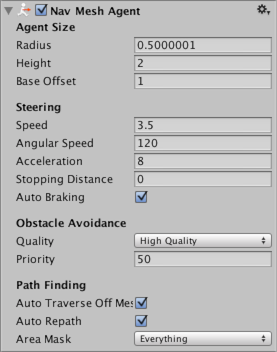
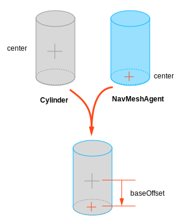

# NavMesh Agent

NavMeshAgent components help you to create characters which avoid each other while moving towards their goal. Agents reason about the game world using the [**NavMesh**][1] and they know how to avoid each other as well as other moving obstacles. Pathfinding and spatial reasoning are handled using the scripting API of the NavMesh Agent.

## Properties
| Property                    | Function                |
|:----------------------------|:------------------------|
| _Agent Size_ |
| **Radius** | Radius of the agent, used to calculate [**collisions**][2] between obstacles and other agents.|
| **Height** | The height clearance the agent needs to pass below an obstacle overhead.|
| **Base offset** | Offset of the collision cylinder in relation to the transform pivot point. |
| _Steering_ |
| **Speed** | Maximum movement speed (in world units per second). | 
| **Angular Speed** | Maximum speed of rotation (degrees per second). |
| **Acceleration** | Maximum acceleration (in world units per second squared). | 
| **Stopping distance** | The agent will stop when this close to the goal location. |
| **Auto Braking** | When enabled, the agent will slow down when reaching the destination. You should disable this for behaviors such patrolling, where the agent should move smoothly between multiple points. |
| _Obstacle Avoidance_ |
| **Quality** | Obstacle avoidance quality. If you have high number of agents you can save CPU time by reducing the obstacle avoidance quality. Setting avoidance to none, will only resolve collision, but will not try to actively avoid other agents and obstacles. |
| **Priority** | Agents of lower priority will be ignored by this agent when performing avoidance. The value should be in the range 0–99 where lower numbers indicate higher priority. |
| _Path Finding_ |
| **Auto Traverse OffMesh Link** | Set to true to automatically traverse off-mesh links. You should turn this off when you want to use animation or some specific way to traverse off-mesh links. |
| **Auto Repath** | When enabled the agent will try to find path again when it reaches the end of a partial path. When there is no path to the destination, a partial path is generated to the closest reachable location to the destination. |
| **Area Mask** | Area mask describes which [area types](./AreasAndCosts.md) the agent will consider when finding a path. When you prepare meshes for NavMesh baking, you can set each meshes area type. For example you can mark stairs with special area type, and forbid some character types from using the stairs. |

## Details

The agent is defined by an upright cylinder whose size is specified by the _Radius_ and _Height_ properties. The cylinder moves with the object but always remains upright even if the object itself rotates. The shape of the cylinder is used to detect and respond to collisions between other agents and obstacles. When the [**GameObject**][3]’s anchor point is not at the base of the cylinder, you can use the _Base Offset_ property to take up the height difference.

The height and radius of the cylinder are actually specified in _two_ different places: the [NavMesh bake settings](./BuildingNavMesh.md) and the properties of the individual agents.

- _NavMesh bake settings_ describe how all the NavMesh Agents are colliding or avoiding the static world geometry. In order to keep memory on budget and CPU load in check, only one size can be specified in the bake settings.
- _NavMesh Agent properties_ values describe how the agent collides with moving obstacles and other agents.

Most often you set the size of the agent the same in both places. But, for example, a heavy soldier may have larger radius, so that other agents will leave more space around him, but otherwise he’ll avoid the environment just the same.

### Additional resources

- [Creating a NavMesh Agent](./CreateNavMeshAgent.md) – workflow on how to create a NavMesh Agent.
- [Inner Workings of the Navigation System](./NavInnerWorkings.md) - learn more about how obstacles are used as part of navigation.
- [NavMesh Agent scripting reference](https://docs.unity3d.com/ScriptReference/AI.NavMeshAgent.html) - full description of the NavMeshAgent scripting API.

[1]: ./BuildingNavMesh.md "A mesh that Unity generates to approximate the walkable areas and obstacles in your environment for path finding and AI-controlled navigation."
[2]: https://docs.unity3d.com/Manual/CollidersOverview.html "A collision occurs when the physics engine detects that the colliders of two GameObjects make contact or overlap, when at least one has a Rigidbody component and is in motion."
[3]: https://docs.unity3d.com/Manual/class-GameObject.html "The fundamental object in Unity scenes, which can represent characters, props, scenery, cameras, waypoints, and more. A GameObject’s functionality is defined by the Components attached to it."