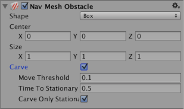
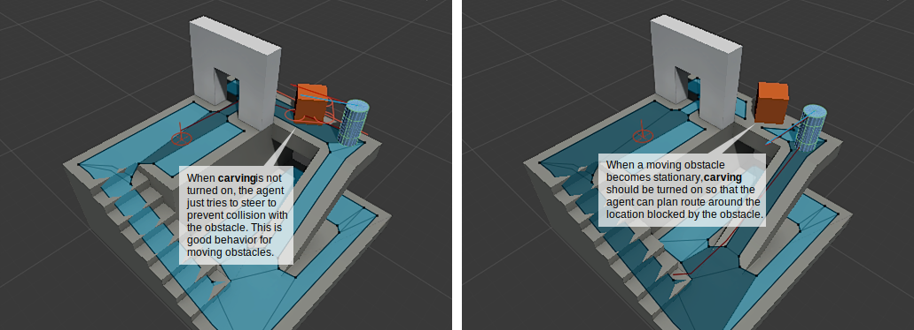
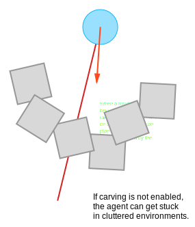

# Nav Mesh Obstacle

The **Nav Mesh Obstacle** component allows you to describe moving obstacles that [Nav Mesh Agents](https://docs.unity3d.com/Manual/class-NavMeshAgent.html) should avoid while navigating the world (for example, barrels or crates controlled by the physics system). While the obstacle is moving, the Nav Mesh Agents do their best to avoid it. When the obstacle is stationary, it carves a hole in the [**NavMesh**][1]. Nav Mesh Agents then change their paths to steer around it, or find a different route if the obstacle causes the pathway to be completely blocked.

| Property | Function |
|:---|:---| 
| **Shape** | The shape of the obstacle geometry. Choose whichever one best fits the shape of the object. |
|     **Box** | |
|         Center | Center of the box relative to the transform position. |
|         Size | Size of the box. |
|     **Capsule** | |
|         Center | Center of the capsule relative to the transform position. |
|         Radius | Radius of the capsule. |
|         Height | Height of the capsule. |
| **Carve** | When the Carve checkbox is ticked, the Nav Mesh Obstacle creates a hole in the NavMesh. |
|     Move Threshold | Unity treats the Nav Mesh Obstacle as moving when it has moved more than the distance set by the Move Threshold. Use this property to set the threshold distance for updating a moving carved hole. |
|     Time To Stationary | The time (in seconds) to wait until the obstacle is treated as stationary. |
|     Carve Only Stationary | When enabled, the obstacle is carved only when it is stationary. See [Logic for moving Nav Mesh Obstacles](https://docs.unity3d.com/Manual/class-NavMeshObstacle.html#LogicMovingObstacles), below, to learn more. |

## Details

Nav Mesh Obstacles can affect the Nav Mesh Agent’s navigation during the game in two ways:

### Obstructing

When **Carve** is not enabled, the default behavior of the Nav Mesh Obstacle is similar to that of a [**Collider**][2]. Nav Mesh Agents try to avoid [**collisions**][3] with the Nav Mesh Obstacle, and when close, they collide with the Nav Mesh Obstacle. Obstacle avoidance behaviour is very basic, and has a short radius. As such, the Nav Mesh Agent might not be able to find its way around in an environment cluttered with Nav Mesh Obstacles. This mode is best used in cases where the obstacle is constantly moving (for example, a vehicle or player character).

### Carving

When **Carve** is enabled, the obstacle carves a hole in the NavMesh when stationary. When moving, the obstacle is an obstruction. When a hole is carved into the NavMesh, the pathfinder is able to navigate the Nav Mesh Agent around locations cluttered with obstacles, or find another route if the current path gets blocked by an obstacle. It’s good practice to turn on carving for Nav Mesh Obstacles that generally block navigation but can be moved by the player or other game events like explosions (for example, crates or barrels).

## Logic for moving Nav Mesh Obstacles

Unity treats the Nav Mesh Obstacle as moving when it has moved more than the distance set by the **Carve** > **Move Threshold**. When the Nav Mesh Obstacle moves, the carved hole also moves. However, to reduce CPU overhead, the hole is only recalculated when necessary. The result of this calculation is available in the next frame update. The recalculation logic has two options:

- Only carve when the Nav Mesh Obstacle is stationary
    
- Carve when the Nav Mesh Obstacle has moved
    

### Only carve when the Nav Mesh Obstacle is stationary

This is the default behavior. To enable it, tick the Nav Mesh Obstacle component’s **Carve Only Stationary** checkbox. In this mode, when the Nav Mesh Obstacle moves, the carved hole is removed. When the Nav Mesh Obstacle has stopped moving and has been stationary for more than the time set by **Carving Time To Stationary**, it is treated as stationary and the carved hole is updated again. While the Nav Mesh Obstacle is moving, the Nav Mesh Agents avoid it using collision avoidance, but don’t plan paths around it.

**Carve Only Stationary** is generally the best choice in terms of performance, and is a good match when the [**GameObject**][4] associated with the Nav Mesh Obstacle is controlled by physics.

### Carve when the Nav Mesh Obstacle has moved

To enable this mode, untick the Nav Mesh Obstacle component’s **Carve Only Stationary** checkbox. When this is unticked, the carved hole is updated when the obstacle has moved more than the distance set by **Carving Move Threshold**. This mode is useful for large, slowly moving obstacles (for example, a tank that is being avoided by infantry).

**Note**: When using NavMesh query methods, you should take into account that there is a one-frame delay between changing a Nav Mesh Obstacle and the effect that change has on the NavMesh.

## See also

1. [Creating a Nav Mesh Obstacle](./CreateNavMeshObstacle.md) - Guidance on creating Nav Mesh Obstacles.
    
2. [Inner Workings of the Navigation System](./NavInnerWorkings.md) - Learn more about how Nav Mesh Obstacles are used as part of navigation.
    
3. [Nav Mesh Obstacle scripting reference](https://docs.unity3d.com/ScriptReference/AI.NavMeshObstacle.html) - Full description of the Nav Mesh Obstacle scripting API.
    
[1]: ./BuildingNavMesh.md "A mesh that Unity generates to approximate the walkable areas and obstacles in your environment for path finding and AI-controlled navigation."
[2]: https://docs.unity3d.com/Manual/CollidersOverview.html "An invisible shape that is used to handle physical collisions for an object. A collider doesn’t need to be exactly the same shape as the object’s mesh - a rough approximation is often more efficient and indistinguishable in gameplay."
[3]: https://docs.unity3d.com/Manual/CollidersOverview.html "A collision occurs when the physics engine detects that the colliders of two GameObjects make contact or overlap, when at least one has a Rigidbody component and is in motion."
[4]: https://docs.unity3d.com/Manual/class-GameObject.html "The fundamental object in Unity scenes, which can represent characters, props, scenery, cameras, waypoints, and more. A GameObject’s functionality is defined by the Components attached to it."