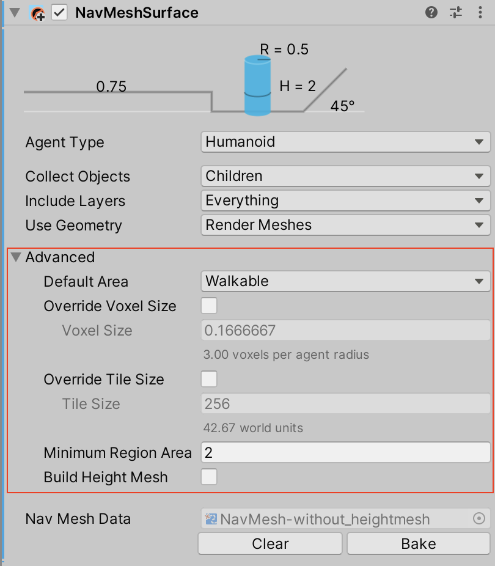

# NavMesh Surface

The NavMesh Surface component represents the walkable area for a specific [NavMesh Agent](https://docs.unity3d.com/Manual/class-NavMeshAgent.html) type, and defines a part of the Scene where a NavMesh should be built. 

To use the NavMesh Surface component, navigate to __GameObject__ > __AI__ > __NavMesh Surface__. This creates an empty GameObject with a NavMesh Surface component attached to it. A Scene can contain multiple NavMesh Surfaces.

You can add the NavMesh Surface component to any GameObject. This is useful for when you want to use the GameObject parenting [Hierarchy](https://docs.unity3d.com/Manual/Hierarchy.html) to define which GameObjects contribute to the NavMesh.

## Parameters
| __Property__        | __Function__                                                                                                                                                                                                                                                                                                                                                                                                                                                          |
|:--------------------|:----------------------------------------------------------------------------------------------------------------------------------------------------------------------------------------------------------------------------------------------------------------------------------------------------------------------------------------------------------------------------------------------------------------------------------------------------------------------|
| __Agent Type__      | The [NavMesh Agent](https://docs.unity3d.com/Manual/class-NavMeshAgent.html) type using the NavMesh Surface. Use for bake settings and matching the NavMesh Agent to proper surfaces during pathfinding.                                                                                                                                                                                                                                                              |
| __Default Area__    | Defines the area type generated when building the NavMesh.  - __Walkable__ (this is the default option)  - __Not Walkable__  - __Jump__   Use the [NavMesh Modifier](NavMeshModifier.md) component to modify the area type in more detail.                                                                                                                                                                                                            |
| __Generate Links__  | If this option is enabled, objects collected by the surface will be considered to generate links during the baking process. See the __Links Generation__ section for more information.                                                                                                                                                                                                                                                                            |
| __Collect Objects__ | Defines which GameObjects to use for baking. - __All__ – Use all active GameObjects (this is the default option). - __Volume__ – Use all active GameObjects overlapping the bounding volume. Geometry outside of the bounding volume but within the agent radius is taken into account for baking. - __Children__ – Use all active GameObjects which are children of the NavMesh Surface component, in addition to the object the component is placed on. |
| __Include Layers__  | Define the layers on which GameObjects are included in the bake process. In addition to __Collect Objects__, this allows for further exclusion of specific GameObjects from the bake (for example, effects or animated characters).  This is set to __Everything__ by default, but you can toggle options on (denoted by a tick) or off individually.                                                                                                             |
| __Use Geometry__    | Select which geometry to use for baking. - __Render Meshes__ – Use geometry from Render Meshes and [Terrains](https://docs.unity3d.com/Manual/terrain-UsingTerrains.html). -  __Physics [Colliders](https://docs.unity3d.com/Manual/CollidersOverview.html)__ – Use geometry from Colliders and Terrains. Agents can move closer to the edge of the physical bounds of the environment with this option than they can with the __Render Meshes__ option.      |

Use the main settings for the NavMesh Surface component to filter the input geometry on a broad scale. Fine tune how Unity treats input geometry on a per-GameObject basis, using the [NavMesh Modifier](NavMeshModifier.md) component. 

The baking process automatically excludes GameObjects that have a NavMesh Agent or NavMesh Obstacle. They are dynamic users of the NavMesh, and so do not contribute to NavMesh building.

## Advanced Settings

The Advanced settings section allows you to customize the following additional parameters:

| __Property__| __Function__ |
|:---|:---|
| __Override Voxel Size__ | Controls how accurately Unity processes the input geometry for NavMesh baking (this is a tradeoff inbetween speed and accuracy). Check the tickbox to enable. The default is unchecked (disabled).  3 voxels per Agent radius (6 per diameter) allows the capture of narrow passages, such as doors, while maintaining a quick baking time. For big open areas, using 1 or 2 voxels per radius speeds up baking. Tight indoor spots are better suited to smaller voxels, for example 4 to 6 voxels per radius. More than 8 voxels per radius does not usually provide much additional benefit. |
| __Override Tile Size__ | In order to make the bake process parallel and memory efficient, the Scene is divided into tiles for baking. The white lines visible on the NavMesh are tile boundaries.   The default tile size is 256 voxels, which provides a good tradeoff between memory usage and NavMesh fragmentation.   To change this default tile size, check this tickbox and, in the __Tile Size__ field,  enter the number of voxels you want the Tile Size to be.   The smaller the tiles, the more fragmented the NavMesh is. This can sometimes cause non-optimal paths. NavMesh carving also operates on tiles. If you have a lot of obstacles, you can often speed up carving by making the tile size smaller (for example around 64 to 128 voxels). If you plan to bake the NavMesh at runtime, using a smaller tile size to keep the maximum memory usage low. |
| __Minimum Region Area__| Allows you to cull away the small regions disconnected from the larger NavMesh. The process that builds the NavMesh does not retain the stretches of the mesh that have a surface size smaller than the specified value. Please note that some areas may not get removed despite the Minimum Region Area parameter. The NavMesh is built in parallel as a grid of tiles. If an area straddles a tile boundary, the area is not removed. The reason for this is that the area pruning step takes place at a stage in the build process when the surrounding tiles are not accessible. |
| __Build Height Mesh__| Enables the creation of additional data used for determining more accurately the height at any position on the NavMesh. See the __Height Mesh__ section for more information. This option is available starting with Unity 2022.2.0f1. |

## Links Generation
A NavMesh Surface can be setup to automatically generate links during the NavMesh baking process. 
For this feature to be enabled multiple conditions must be respected:
- NavMesh Agent type settings used by the surface must contain a non zero __Drop Height__ value or a non zero __Jump Distance__ value (both can be used simultaneously)
- Objects collected by the surface must be considered for links generation, here two options:
  - when __Generate Links__ is enabled, the surface considers by default all collected objects (links generation can be disabled per object using the NavMeshModifier component)
  - when __Generate Links__ is disabled, the collected objects are not considered by default (links generation can be enabled per object using the NavMeshModifier component)

.")

## Height Mesh
The Height Mesh allows for the character to be placed more accurately on the ground. While navigating, the NavMesh Agent is constrained on the surface of the NavMesh. Since the NavMesh is an approximation of the walkable space, some features are evened out when the NavMesh is being built. For example, stairs may appear as a slope in the NavMesh. Without the Height Mesh the characters are moved along the approximate NavMesh surface. If your game requires accurate placement of the agent, you should enable the Height Mesh option when you build the NavMesh. Note that building the Height Mesh will take up memory and processing at runtime, and it will lengthen the total time of baking the NavMesh.

. The blue area shows the NavMesh which is used for path finding. The pink area (including the area under the NavMesh) represents the height mesh which is used for more accurate placement of the Agent while it moves along the calculated path.")
