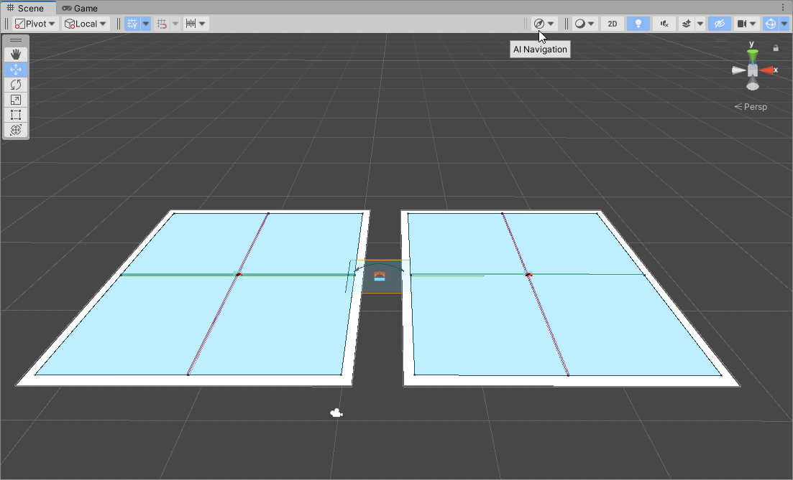
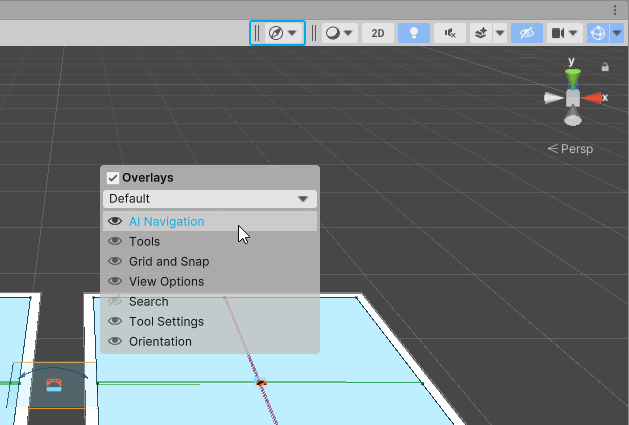
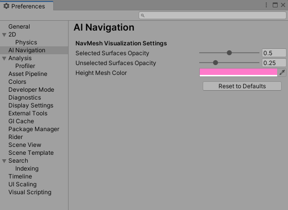

# Navigation debug visualization

To better understand the navigation space and the behavior of the [NavMeshAgents](https://docs.unity3d.com/Manual/class-NavMeshAgent.html) acting in your scene, we provide ways to visualize the different navigation-related states. 
The central tool enabling you to display this information is the <b>AI Navigation Overlay</b>. 
You can also find some settings to tweak the debug display in your editor's preferences.

## Debug visualization overlay

Within Unity's scene view overlays, we've added a specific one to control the navigation debug visualization.

This overlay is enabled and docked by default in the scene view top toolbar. 

You can control the overlay availability like you would for any overlay. See the [Overlay](https://docs.unity3d.com/Manual/overlays.html) section in the manual. 
The navigation overlay is named <i>AI Navigation</i>. 

### Overlay control parameters

| __Section__   | __Parameter__             | __Function__                                                                                                                                                                                     |
|:--------------|:--------------------------|:-------------------------------------------------------------------------------------------------------------------------------------------------------------------------------------------------|
| __Surfaces__  |                           | List of parameters controlling the way [NavMeshSurface](NavMeshSurface.md) instances are displayed.                                                                                              |
|               | __Show Only Selected__    | When this option is enabled, only surfaces part of the current scene selection hierarchy are displayed. Opacity can be set depending on the surface's selection state using the preferences. |
|               | __Show NavMesh__          | Display navigation meshes for the relevant surfaces. The colors used to display this mesh are the ones defined for the area types.                                                           |
|               | __Show HeightMesh__       | Display HeightMeshes (surface precise elevation information) for the relevant surfaces.                                                                                                          |
| __Agents__    |                           | List of parameters controlling the displayed information for the currently selected [NavMeshAgent](https://docs.unity3d.com/Manual/class-NavMeshAgent.html) instances.                           |
|               | __Show Path Polygons__    | NavMesh polygons part of the agent's path are displayed in a darker color.                                                                                                                       |
|               | __Show Path Query Nodes__ | Path nodes explored during the pathfinding query are drawn in yellow.                                                                                                                            |
|               | __Show Neighbours__       | Display the collision avoidance neighbours (dynamic obstacles) relative to the agent.                                                                                                            |
|               | __Show Walls__            | Display the collision avoidance walls (static obstacles) for an agent.                                                                                                                           |
|               | __Show Avoidance__        | Show the different positions sampled during the collision avoidance process.                                                                                                                     |
| __Obstacles__ |                           | List of parameters controlling the displayed information for the currently selected [NavMeshObstacle](https://docs.unity3d.com/Manual/class-NavMeshObstacle.html) instances.                     |
|               | __Show Carve Hull__       | Display the convex shape that will be used to carve the NavMesh.                                                                                                                                 |

These parameters are controlled by the overlay but saved as user's editor preferences and kept in between Unity's session.

## Debug visualization preferences

In the [Editor Preferences](https://docs.unity3d.com/Manual/Preferences.html) window, you can find a few options to customize the debug visualization.

| __Parameter__                  | __Function__                                                                                                                                                    |
|:-------------------------------|:----------------------------------------------------------------------------------------------------------------------------------------------------------------|
| __Selected Surface Opacity__   | Opacity of the displayed meshes (NavMesh and HeightMesh) for [NavMeshSurface](NavMeshSurface.md) instances that are part of the current selection hierarchy.    |
| __Unselected Surface Opacity__ | Opacity of the displayed meshes (NavMesh and HeightMesh) for [NavMeshSurface](NavMeshSurface.md) instances that are outside of the current selection hierarchy. |
| __Height Mesh Color__          | Color used to display the NavMeshSurface precise elevation information or HeightMesh.                                                                           |

| __Action__            |                                                                               |
|:----------------------|:------------------------------------------------------------------------------|
| __Reset to Defaults__ | Set all the NavMesh Visualization Settings parameters to their default value. |