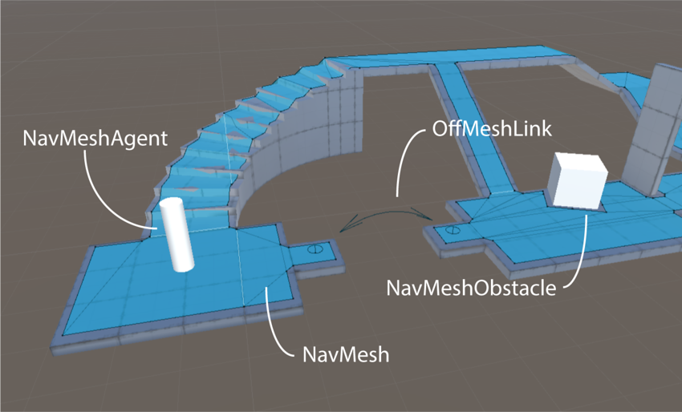

# Navigation System in Unity

The Navigation System allows you to create characters which can navigate the game world. It gives your characters the ability to understand that they need to take stairs to reach second floor, or to jump to get over a ditch. The Unity [**NavMesh**][1] system consists of the following pieces:

- **NavMesh** (short for Navigation Mesh) is a data structure which describes the walkable surfaces of the game world and allows to find path from one walkable location to another in the game world. The data structure is built, or baked, automatically from your level geometry.
- **NavMesh Agent** component help you to create characters which avoid each other while moving towards their goal. Agents reason about the game world using the NavMesh and they know how to avoid each other as well as moving obstacles.
- **Off-Mesh Link** component allows you to incorporate navigation shortcuts which cannot be represented using a walkable surface. For example, jumping over a ditch or a fence, or opening a door before walking through it, can be all described as Off-mesh links.
- **NavMesh Obstacle** component allows you to describe moving obstacles the agents should avoid while navigating the world. A barrel or a crate controlled by the physics system is a good example of an obstacle. While the obstacle is moving the agents do their best to avoid it, but once the obstacle becomes stationary it will carve a hole in the navmesh so that the agents can change their paths to steer around it, or if the stationary obstacle is blocking the path way, the agents can find a different route.

[1]: ./BuildingNavMesh.md "A mesh that Unity generates to approximate the walkable areas and obstacles in your environment for path finding and AI-controlled navigation."