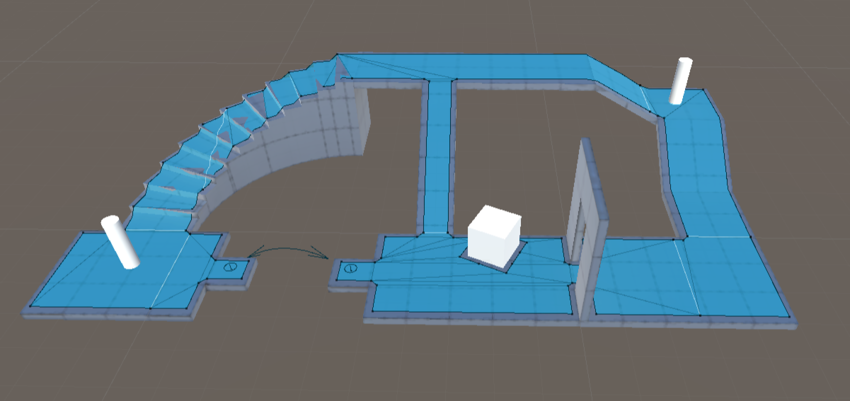

# Navigation and Pathfinding

The navigation system allows you to create characters that can intelligently move around the game world, using navigation meshes that are created automatically from your [**Scene**][1] geometry. Dynamic obstacles allow you to alter the navigation of the characters at runtime, while off-mesh links let you build specific actions like opening doors or jumping down from a ledge. This section describes Unity's navigation and pathfinding systems in detail.

You can learn more on how to visualize your scene's navigation information in the [Navigation Debug Visualization](NavigationDebugVisualization.md) section of this documentation.

**Related tutorials:** [Navigation](http://unity3d.com/learn/tutorials/topics/navigation)

Search the [Unity Knowledge Base](https://support.unity3d.com/hc/en-us) for tips, tricks and troubleshooting.

[1]: https://docs.unity3d.com/Manual/CreatingScenes.html "A Scene contains the environments and menus of your game. Think of each unique Scene file as a unique level. In each Scene, you place your environments, obstacles, and decorations, essentially designing and building your game in pieces."